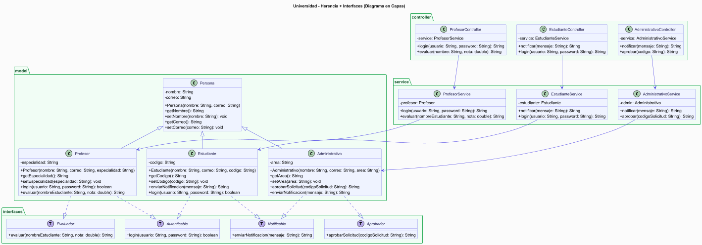

# 🎓 API Universidad - Herencia + Interfaces

Proyecto desarrollado en **Java con Spring Boot** que implementa los conceptos de
herencia simple, herencia múltiple mediante interfaces, y arquitectura en capas (MVC).

---

## 📐 Diagrama UML en Capas

---

## 🏗️ Arquitectura del proyecto

El proyecto está organizado en capas:

- **interfaces/** → Define los comportamientos que deben implementar las clases
- **model/** → Clases con atributos, constructores y getters/setters
- **service/** → Lógica del negocio
- **controller/** → Endpoints de la API REST

---

## 🧬 Relaciones del diagrama

### Herencia simple (extends)
| Clase hija | Clase padre |
|------------|-------------|
| Administrativo | Persona |
| Estudiante | Persona |
| Profesor | Persona |

### Herencia múltiple via interfaces (implements)
| Clase | Interfaces que implementa |
|-------|--------------------------|
| Administrativo | Aprobador, Notificable |
| Estudiante | Notificable, Autenticable |
| Profesor | Autenticable, Evaluador |

---

## 🌐 Endpoints de la API

### 👨‍🎓 Estudiante
| Método | URL | Descripción |
|--------|-----|-------------|
| GET | `/estudiante/login?usuario=ana@uni.edu&password=EST-2024` | Login estudiante |
| GET | `/estudiante/notificar?mensaje=Tienes examen` | Enviar notificación |

### 🧑‍💼 Administrativo
| Método | URL | Descripción |
|--------|-----|-------------|
| GET | `/administrativo/aprobar?codigo=SOL-001` | Aprobar solicitud |
| GET | `/administrativo/notificar?mensaje=Reunion manana` | Enviar notificación |

### 👨‍🏫 Profesor
| Método | URL | Descripción |
|--------|-----|-------------|
| GET | `/profesor/login?usuario=juan@uni.edu&password=Matematicas` | Login profesor |
| GET | `/profesor/evaluar?nombre=Ana&nota=4.5` | Evaluar estudiante |

---

## ✅ Ejemplos de respuestas

**Login correcto:**